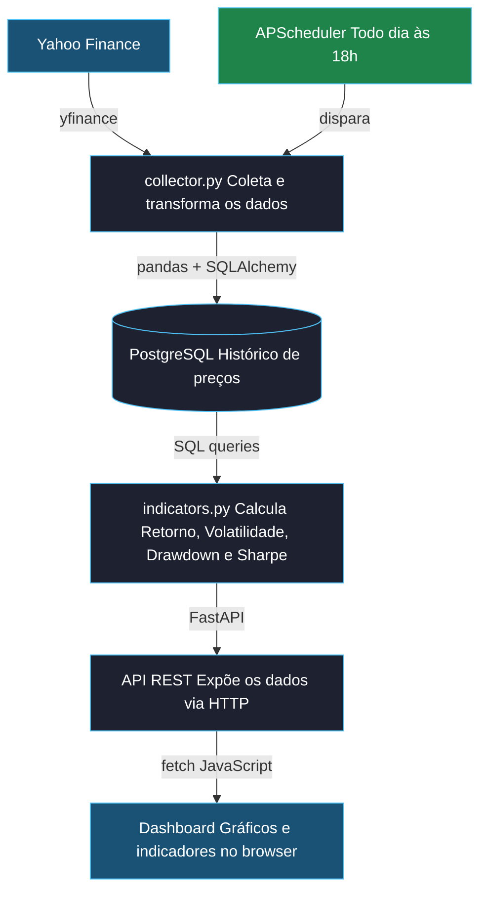

# 📈 FinSight


O FinSight é um sistema end-to-end de análise de carteiras de investimentos. Ele coleta dados reais de ativos financeiros, armazena em banco de dados relacional, calcula indicadores de performance e os exibe em um dashboard web interativo — cobrindo todo o fluxo de dados que analistas de fundos operam no dia a dia.

## Preview


---

## Problema que resolve

- Analistas perdem tempo consolidando manualmente dados de múltiplas fontes
- Indicadores financeiros (Sharpe, drawdown, volatilidade) são calculados de forma descentralizada e sem histórico
- Não há uma visão unificada e automatizada da performance de uma carteira

## Proposta de valor

- Pipeline automatizado de coleta → armazenamento → cálculo → visualização
- Indicadores financeiros calculados com SQL + Python sobre dados históricos reais
- Dashboard web acessível, sem necessidade de ferramentas pagas ou complexas

---

## Funcionalidades

- **Dashboard de indicadores** — Retorno acumulado, Volatilidade, Drawdown máximo, Sharpe Ratio e Variação diária
- **Alertas visuais** — Cards destacados quando a variação diária ultrapassa ±3%
- **Gráfico de preços** — Histórico interativo com períodos de 3M, 6M e 1A
- **Comparação de ativos** — Até 5 ativos no mesmo gráfico com retorno normalizado
- **Busca com autocomplete** — Busca por nome ou ticker com navegação por teclado
- **Matriz de correlação** — Visualização colorida de como os ativos se movem juntos
- **Simulador de carteira** — Define pesos por ativo e vê retorno consolidado vs Ibovespa
- **Tema claro/escuro** — Toggle com preferência salva no navegador
- **Coleta automática** — APScheduler coleta dados todo dia às 18h
- **Cache de respostas** — Reduz consultas repetidas ao banco de dados
- **20+ ativos** — Ações, FIIs e índices da B3 e S&P 500
- **86% de cobertura de testes** — Testes automatizados com pytest

---


## Como funciona

O FinSight opera como um pipeline de dados em 5 etapas — da coleta automática até a visualização no browser.


> **Coleta automática:** o APScheduler dispara a coleta todos os dias às 18h, após o fechamento do mercado brasileiro, mantendo os dados sempre atualizados sem intervenção manual.


---

## Stack

| Camada | Tecnologia | Justificativa |
|---|---|---|
| Coleta de Dados | Python + yfinance | Acesso gratuito a dados reais de ativos brasileiros (B3) e internacionais via Yahoo Finance |
| Manipulação | pandas + NumPy | Padrão da indústria financeira para transformação e análise de séries temporais |
| Banco de Dados | PostgreSQL | Banco relacional robusto, mais usado em ambientes corporativos financeiros |
| Backend / API | Python + FastAPI | Framework moderno, leve e com documentação automática via Swagger |
| Frontend | HTML + CSS + JS | Vanilla JS modular, sem frameworks desnecessários |
| Gráficos | Chart.js | Biblioteca JS leve e popular para dashboards financeiros interativos |
| Testes | pytest | 86% de cobertura com testes unitários e de integração |
| Agendamento | APScheduler | Coleta automática diária sem intervenção manual |
| Versionamento | Git + GitHub | Controle de versão com histórico claro de commits |

---

## Como rodar localmente

### Pré-requisitos
- Python 3.11+
- PostgreSQL 17

### 1. Clone o repositório
```bash
git clone https://github.com/PedroKeita/Finsight.git
cd finsight
```

### 2. Crie e ative o ambiente virtual
```bash
python -m venv venv
venv\Scripts\activate  # Windows
source venv/bin/activate  # Linux/Mac
```

### 3. Instale as dependências
```bash
python -m pip install -r requirements.txt
```

### 4. Configure o banco de dados
```bash
psql -U postgres -c "CREATE DATABASE finsight;"
psql -U postgres -d finsight -f schema.sql
```

### 5. Configure o arquivo .env
Copie o `.env.example` e preencha com seus valores:
```bash
cp .env.example .env
```

| Variável | Descrição | Padrão |
|---|---|---|
| DATABASE_URL | URL de conexão com o PostgreSQL | — |
| RISK_FREE_RATE | Taxa livre de risco (CDI) para o Sharpe | 0.13 |
| SCHEDULER_HOUR | Hora da coleta automática diária | 18 |
| SCHEDULER_MINUTE | Minuto da coleta automática diária | 0 |
| FRONTEND_URL | URL do frontend para configuração do CORS | http://127.0.0.1:5500 |
| API_PORT | Porta da API | 8000 |
| DEBUG | Ativa reload automático em desenvolvimento | false |

### 6. Popule os ativos iniciais
```bash
cd backend
python seed.py
```

### 7. Colete os dados históricos
```bash
python collector.py
```

### 8. Suba a API
```bash
python run.py
```

Acesse a documentação interativa em: **http://127.0.0.1:8000/docs**

---

## Endpoints

### GET /assets
Lista todos os ativos cadastrados.

**Resposta:**
```json
[
  {"id": 1, "ticker": "PETR4.SA", "name": "Petrobras", "category": "ação", "logo_url": "..."}
]
```

### GET /prices/{ticker}
Retorna o histórico de preços de um ativo.

| Parâmetro | Tipo | Padrão | Descrição |
|---|---|---|---|
| ticker | path | — | Código do ativo (ex: PETR4.SA) |
| period | query | 1y | Período: `1y`, `6m`, `3m` |

### GET /indicators/{ticker}
Retorna os indicadores financeiros de um ativo.

| Parâmetro | Tipo | Padrão | Descrição |
|---|---|---|---|
| ticker | path | — | Código do ativo (ex: PETR4.SA) |
| period | query | 1y | Período: `1y`, `6m`, `3m` |

**Resposta:**
```json
{
  "return": 37.57,
  "volatility": 24.46,
  "drawdown": -19.32,
  "sharpe": 0.99,
  "daily_variation": -0.73
}
```

### GET /correlation/
Retorna a matriz de correlação entre todos os ativos.

| Parâmetro | Tipo | Padrão | Descrição |
|---|---|---|---|
| period | query | 1y | Período: `1y`, `6m`, `3m` |

### POST /portfolio/
Simula o retorno de uma carteira com pesos definidos.

**Body:**
```json
{
  "allocations": [
    {"ticker": "PETR4.SA", "weight": 0.40},
    {"ticker": "VALE3.SA", "weight": 0.30},
    {"ticker": "ITUB4.SA", "weight": 0.30}
  ],
  "period": "1y"
}
```

**Resposta:**
```json
{
  "return": 49.03,
  "volatility": 16.58,
  "sharpe": 1.74,
  "history": [...],
  "benchmark_history": [...]
}
```

### POST /collect/{ticker}
Dispara coleta de dados de um ativo específico.

### POST /collect/all
Atualiza dados de todos os ativos cadastrados.

---

## Indicadores Financeiros

| Indicador | Fórmula | O que mede |
|---|---|---|
| Retorno Acumulado | (Preço final / Preço inicial) - 1 | Quanto o ativo valorizou no período |
| Volatilidade | Desvio padrão dos retornos diários × √252 | Risco do ativo — quanto o preço oscila |
| Drawdown Máximo | Maior queda do pico ao vale | Pior momento do ativo no período |
| Sharpe Ratio | (Retorno - CDI) / Volatilidade | Qualidade do retorno ajustado ao risco |
| Variação Diária | (Preço hoje - Preço ontem) / Preço ontem | Movimento do dia — alerta acima de ±3% |

---

## Testes
```bash
cd backend
pytest tests/ -v --cov=. --cov-report=term-missing
```

Cobertura atual: **86%**

---

## Planejamento do Projeto

O FinSight foi planejado seguindo metodologia ágil, com épicas, histórias de usuário, critérios de aceitação e tasks técnicas definidas antes do desenvolvimento.

| Épica | Descrição | Status |
|---|---|---|
| EP-01 — Infraestrutura | Ambiente, PostgreSQL e modelagem do banco | ✅ Concluída |
| EP-02 — Coleta de Dados | Pipeline yfinance → PostgreSQL | ✅ Concluída |
| EP-03 — Indicadores | Retorno, Volatilidade, Drawdown, Sharpe | ✅ Concluída |
| EP-04 — API REST | Endpoints FastAPI com documentação Swagger | ✅ Concluída |
| EP-05 — Dashboard | Interface web com gráficos interativos | ✅ Concluída |
| EP-06 — Melhorias | Refatoração por módulos e atualização automática | ✅ Concluída |
| EP-07 — Expansão de Ativos | Mais tickers, logos e identidade visual | ✅ Concluída |
| EP-08 — Autocomplete | Campo de busca inteligente | ✅ Concluída |
| EP-09 — Comparação | Gráfico comparativo normalizado | ✅ Concluída |
| EP-10 — Qualidade Técnica | Testes, cache, agendamento e configuração | ✅ Concluída |
| EP-11 — Documentação | Badges, diagrama e GIF animado | ✅ Concluída |
| EP-12 — Funcionalidades Financeiras | Correlação, simulador e alertas | ✅ Concluída |
| EP-13 — Visual e UX | Tema claro/escuro | ✅ Concluída |

> O planejamento completo com histórias de usuário e critérios de aceitação está disponível em [`Documentação Épicas e User Stories`](docs/Epics_UserStories.md)

